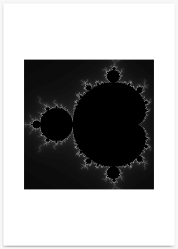
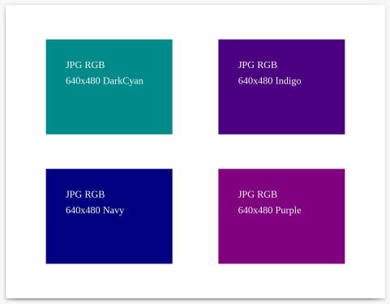
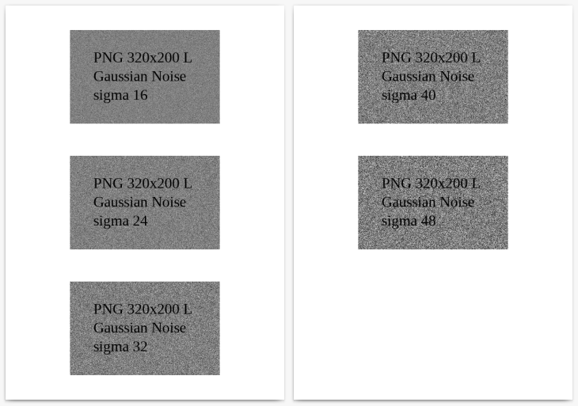

.. image:: https://github.com/myrmica-habilis/pictureshow/workflows/pytest/badge.svg

Save pictures to PDF — from the command line, or from your Python programs.

Requirements
------------

Python 3.6 or higher is required. The only direct dependency is the wonderful `reportlab <https://pypi.org/project/reportlab/>`__ library.

Installation
------------

.. code::

    pip install pictureshow

As a command line tool
----------------------

Usage:

.. code::

    usage: pictureshow [-h] [-p SIZE] [-L] [-m MARGIN] [-l LAYOUT] [-s] [-f] [-q]
                       [-v]
                       PIC [PIC ...] PDF

    positional arguments:
      PIC                   one or more input picture file paths
      PDF                   output PDF file path

    optional arguments:
      -h, --help            show this help message and exit
      -p SIZE, --page-size SIZE
                            specify page size; default is A4
      -L, --landscape       force landscape orientation of page
      -m MARGIN, --margin MARGIN
                            set width of empty space around pictures; default is
                            72 points (1 inch)
      -l LAYOUT, --layout LAYOUT
                            specify grid layout of pictures on page; default is
                            1x1
      -s, --stretch-small   scale small pictures up to fit drawing area
      -f, --force-overwrite
                            save output file even if filename exists
      -q, --quiet           suppress printing to stdout
      -v, --version         show program's version number and exit

Simple example — saving a single picture to PDF:

.. code::

    $ pictureshow pics/mandelbrot.png mandelbrot.pdf
    Saved 1 picture to '/.../mandelbrot.pdf'

With the resulting PDF document:

Using a glob pattern, setting page to landscape Letter-sized and layout to 2x2 pictures per page:

.. code::

    $ pictureshow pics/*.jpg jpg_pics.pdf --page-size=LETTER --landscape --layout=2x2
    1 file skipped because of error.
    Saved 4 pictures to '/.../jpg_pics.pdf'

With the resulting PDF document:

Setting half-inch margin, 1x3 pictures per page:

.. code::

    $ pictureshow -m36 -l1x3 pics/noise*.* noise.pdf
    Saved 5 pictures to '/.../noise.pdf'

With the resulting PDF document:

Combining glob pattern and additional filenames, overwriting existing output file, stretching small pictures to page, with zero margin:

.. code::

    $ pictureshow chart.gif *.jpg figure.png pics.pdf -fsm0
    Saved 6 pictures to '/.../pics.pdf'

As a Python library
-------------------

Using the ``PictureShow`` class:

.. code-block:: python

    from pictureshow import PictureShow

    pic_show = PictureShow('pic1.png', 'pic2.jpg', 'pic3.gif')
    pic_show.save_pdf('pictures.pdf')

Using the ``pictures_to_pdf`` shortcut function:

.. code-block:: python

    from pictureshow import pictures_to_pdf

    pictures_to_pdf('pic1.png', 'pic2.jpg', 'pic3.gif', 'pictures.pdf')

The example above will work as long as the output file is passed as the last positional argument. It is however recommended to always use a keyword argument:

.. code-block:: python

    from pictureshow import pictures_to_pdf

    list_of_pictures = ['pic1.png', 'pic2.jpg', 'pic3.gif']
    pictures_to_pdf(*list_of_pictures, pdf_file='pictures.pdf')

Another example, demonstrating all available keyword parameters:

.. code-block:: python

    from pathlib import Path

    from pictureshow import pictures_to_pdf

    list_of_pictures = sorted(Path.cwd().glob('screenshots/*.png'))
    pictures_to_pdf(
        *list_of_pictures,
        pdf_file='screenshots.pdf',
        page_size='A5',
        landscape=True,
        margin=36,
        layout=(2, 2),
        stretch_small=True,
        force_overwrite=True
    )

The ``page_size`` and ``layout`` parameters can be specified either by a string or by a sequence of two numbers. For example, ``page_size='LETTER', layout='2x3'`` is equivalent to ``page_size=(72 * 8.5, 72 * 11), layout=(2, 3)``.
